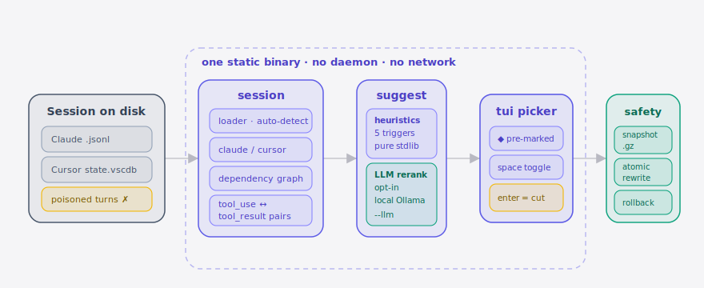

<!-- LANGUAGE: [English](README.md) | [简体中文](README.zh-CN.md) -->

<p align="center">
  
</p>

<p align="center">
  <a href="https://github.com/SuperMarioYL/excise/actions/workflows/ci.yml"></a>
  <a href="https://golang.org/dl/"></a>
  <a href="LICENSE"></a>
  <a href="https://github.com/SuperMarioYL/excise/releases"></a>
  <a href="https://github.com/SuperMarioYL/excise/stargazers"></a>
  <a href="https://goreportcard.com/report/github.com/SuperMarioYL/excise"></a>
</p>

<p align="center">
  
</p>

<p align="center">
  <a href="https://asciinema.org/a/ASCIINEMA-ID">
    
  </a>
  <br/>
  <em>30-second demo · click to play · or see <code>docs/demo.cast</code> in this repo</em>
</p>

---

## What is Excise?

Anthropic's own documentation observes that more than two corrections in a
single Claude Code session reliably poisons the trajectory — the agent starts
fighting ghosts of the cut-off path you abandoned. The fix today is
`/clear` (lose all context) or `/compact` (lose nuance). **Excise** is the
missing third option: a single-binary CLI that opens an interactive picker
over the session JSONL on disk, lets you cut the three turns that took the
agent down the dead end, and writes the file back with snapshot-and-undo
safety.

```
        before              after
    ┌──────────────┐    ┌──────────────┐
    │ user         │    │ user         │
    │ assistant    │    │ assistant    │
    │ user         │ ─▶ │   (excised)  │
    │ assistant ✗  │    │   (excised)  │
    │ user         │    │ user         │
    │ assistant ✓  │    │ assistant ✓  │
    └──────────────┘    └──────────────┘
```

The primitive `Excise(Session, set<turn_id>) -> Session'` preserves four
invariants: **(1)** removing a `tool_use` turn also removes its paired
`tool_result`, **(2)** removing a `tool_result` warns about the surviving
owner, **(3)** ordering and stable ids are preserved, **(4)** writes are
atomic (snapshot, write-to-tmp, rename).

## Table of contents

- [Install](#install)
- [Quick start](#quick-start)
- [v0.2 — Suggestions](#v02--suggestions)
- [v0.3 — LLM rerank (opt-in, local Ollama)](#v03--llm-rerank-opt-in-local-ollama)
- [Commands](#commands)
- [How dependency-aware cutting works](#how-dependency-aware-cutting-works)
- [Snapshots and rollback](#snapshots-and-rollback)
- [Supported transcript formats](#supported-transcript-formats)
- [Architecture](#architecture)
- [Trust contract](#trust-contract)
- [Roadmap](#roadmap)
- [Out of scope (on purpose)](#out-of-scope-on-purpose)
- [Contributing](#contributing)
- [License](#license)

## Install

```bash
# via go
go install github.com/SuperMarioYL/excise/cmd/excise@latest

# via homebrew (after the tap is published — see BUILD_SETUP_NEXT_STEPS.md)
brew install supermarioyl/tap/excise

# from source
git clone https://github.com/SuperMarioYL/excise && cd excise
go build -o ./excise ./cmd/excise
```

Excise ships as a single ~8 MB static binary. No runtime, no daemon, no
network call.

## Quick start

```bash
# Zero-arg: auto-discover the newest Claude Code session and open the picker
excise

# Render the turn table, no edits
excise list

# Open the picker on a specific session file
excise pick ~/.claude/projects/-home-me-app/SESSION-UUID.jsonl

# Non-interactive cut: remove turns 5-7 and 9
excise cut 5-7,9 ~/.claude/projects/-home-me-app/SESSION-UUID.jsonl

# Same, but for a Cursor session
excise --tool=cursor cut 12-14 "~/Library/Application Support/Cursor/User/globalStorage/state.vscdb"

# Restore the most recent snapshot
excise rollback --list
excise rollback <snapshot-id>
```

In the TUI:

| key | action |
| --- | --- |
| `j` / `↓` | move down |
| `k` / `↑` | move up |
| `g` / `G` | jump to top / bottom |
| `space` / `x` | toggle mark on current turn |
| `d` | mark + move down |
| `enter` | commit the cut |
| `q` / `ctrl+c` | abort without changes |

The header live-updates `turns: 42 → 39   tokens: ~18.2k → ~12.4k` as you mark.

## v0.2 — Suggestions

`excise suggest` runs a **pure-stdlib heuristic scorer** over the session and
nominates the top-K candidate turns to excise. Zero network, no LLM, no
auto-cut — the scorer only suggests; you still confirm in the TUI.

```text
 #   role        tokens   heuristic                                        preview
---  ---------   ------   ----------------------------------------------   ----------------------
 17  assistant     2840   high_token_cost + user_correction_follows_up     "Let me try refactoring …"
 19  tool_use       420   tool_use_error_then_correction                   Edit(path=foo, …) ERROR
 32  assistant     3100   high_token_cost + repeated_file_edit             "Actually let me revert …"
 33  assistant     1820   repeated_file_edit + user_correction_follows_up  "I'll switch to using …"
 47  assistant     2200   long_drift_no_tool_calls + high_token_cost       "To summarize what we …"

5 candidates totalling ~10,380 tokens. Run `excise pick` to review interactively.
```

Five heuristics contribute to each turn's score:

| trigger | what it fires on |
| --- | --- |
| `high_token_cost` | assistant or tool turn weighing ≥ 2 000 tokens |
| `repeated_file_edit` | same file edited 3+ times in a row (window = 3) |
| `user_correction_follows_up` | next user turn matches the **bilingual** correction lexicon (`no`, `actually`, `try a different approach`, `不对`, `换个思路` …) |
| `tool_use_error_then_correction` | a tool returned an error AND the next user turn said so |
| `long_drift_no_tool_calls` | 5+ consecutive assistant turns with no `tool_use` |

`excise pick` calls the scorer **by default** and pre-marks the top-K
candidates in the TUI — those marks render with a `[◆]` glyph instead of
the manual `[x]`. Toggle freely with `space`; commit only honors your final
marks. Pass `--no-suggest` to restore v0.1 behavior.

```bash
# Dry-run the suggestion engine — never touches the file
excise suggest

# Top-3, only above score 1.5, JSON output
excise suggest --top=3 --min-score=1.5 --json testdata/claude_session_polluted.jsonl

# Skip the pre-mark — v0.1 picker behavior
excise pick --no-suggest
```

The scorer is a **pure function of one session**: no cross-session learning,
no acceptance log written, no shared cache. That keeps the trust premise
intact and means a v0.2 binary on an air-gapped machine behaves identically
to one online.

## v0.3 — LLM rerank (opt-in, local Ollama)

v0.3 lets you *optionally* layer a local Ollama model on top of the v0.2
heuristic shortlist. The heuristic stays the cheap pre-filter; the LLM only
judges that shortlist and writes a one-line reason per turn. Default behaviour
is unchanged from v0.2 — `--llm` is the only switch.

```bash
# install ollama (https://ollama.com), then pull a small model:
ollama pull llama3.2

# point excise at it, just for this run:
excise suggest --llm session.jsonl
excise pick --llm session.jsonl     # TUI shows the LLM reason next to each pre-marked turn
```

Optional `excise.toml` (discovered at `./excise.toml` → `$XDG_CONFIG_HOME/excise/excise.toml`
→ `~/.config/excise/excise.toml`):

```toml
[llm]
host = "http://localhost:11434"   # your Ollama
model = "llama3.2"
top_n = 5
timeout_sec = 20
```

**Graceful fallback.** If Ollama is unreachable, the model is missing, the call
times out, or the response is malformed, Excise prints one line to stderr —

```
[excise] LLM unavailable (<reason>) — falling back to heuristic ranking
```

— and continues with the v0.2 heuristic result. You always get *some* output;
`--llm` set in muscle memory never hard-blocks you.

**Trust contract under `--llm`** (unchanged from v0.1/v0.2):

- **No outbound network** beyond the host you configured. Default
  `http://localhost:11434` is your own Ollama; if you point elsewhere you made
  that choice explicitly.
- **No autocut.** `--llm` only changes the *ranking* — every excision is still
  user-confirmed in the TUI or via explicit `excise cut <range>`.
- **No telemetry, no acceptance log, no cross-session learning.** Same posture
  as v0.1/v0.2.

### Remote backend (v0.4, opt-in)

As of v0.4 you can point the reranker at a remote provider instead of local
Ollama. The trust premise is preserved by being **explicit and opt-in**:

- The default backend stays `ollama` (local-only). A remote call happens **only**
  when you set `backend = "remote"` **and** supply a key.
- On every remote call the destination host is echoed to stderr — an outbound
  call is never silent.
- Same graceful fallback as the Ollama path: on auth failure / timeout /
  unreachable host, `excise` prints a one-line stderr warning and falls back to
  the heuristic ranking (exit 0).

```toml
[llm]
backend  = "remote"            # ollama (default) | remote
provider = "openai"            # openai | anthropic | openrouter
model    = "gpt-4o-mini"
api_key_env = "OPENAI_API_KEY" # prefer an env var over an inline api_key
# base_url = "https://api.openai.com"   # optional host override
```

CLI overrides `--llm-backend` and `--llm-provider` take precedence over the
config block. A live remote integration test exists but is gated behind
`EXCISE_LIVE_REMOTE=1` (CI never calls a real provider).

## Commands

```
excise [path]                      open the TUI (auto-discover if no path; pre-mark via heuristics)
excise list [path]                 print the turn table (no edits)
excise pick [path]                 open the TUI (alias for the bare command)
excise cut <range> [path]          non-interactive; e.g. "5-7,9"
excise suggest [path]              v0.2 — print top-K heuristic candidates (read-only)
excise rollback --list             list every snapshot, newest first
excise rollback <snapshot-id>      restore one snapshot

global flags:
  --tool       auto|claude|cursor   transcript format (default: auto)
  --session    PATH                 explicit session path
  --force                           proceed despite dependency warnings
  --dry-run                         show the diff but do not write
  -y, --yes                         skip the confirmation prompt
  --no-suggest                      v0.2 — skip the heuristic pre-mark in the picker
  --llm                             v0.3 — rerank the heuristic shortlist via local Ollama
  --llm-model NAME                  v0.3 — override model from excise.toml (e.g. llama3.2)
  --llm-host URL                    v0.3 — override host from excise.toml

suggest-only flags:
  --top N                           show at most N suggestions (0 = all; default 5)
  --min-score X                     drop suggestions below score X (default 0)
  --json                            emit JSON instead of a table
```

## How dependency-aware cutting works

A Claude Code (or Cursor) turn that issues a tool call creates a downstream
`tool_result` turn. If you cut the tool call but leave its result behind, the
agent's next turn references a `tool_use_id` that no longer exists and the
model gets confused.

Excise builds a dependency graph from every `tool_use.id` ↔ `tool_result.tool_use_id`
edge, computes the transitive closure of your marked set, and (a) pulls every
dependent result into the cut automatically (invariant 1), and (b) warns when
your selection would orphan a `tool_result` whose owner survives (invariant 2).
Pass `--force` to override the warning.

## Snapshots and rollback

Every commit copies the source file to:

```
~/.excise/snapshots/<session-id>/<rfc3339-timestamp>.jsonl.gz
```

and appends a JSON line to `~/.excise/edit_log.jsonl` recording what was
removed, when, and why. Snapshots older than 30 days are auto-pruned on the
next commit so the directory stays bounded.

`excise rollback <snapshot-id>` restores byte-for-byte. The original
destination is read from the edit log; override with `--to <path>` if you
moved the session file.

## Supported transcript formats

| Tool | Path | Read | Write |
| --- | --- | --- | --- |
| **Claude Code** | `~/.claude/projects/<dir>/<uuid>.jsonl` | yes | atomic rewrite of the original |
| **Cursor** | `~/Library/Application Support/Cursor/User/globalStorage/state.vscdb` | yes (via `sqlite3` CLI, read-only) | side-car `.excised.jsonl` to avoid corrupting an open db |
| **Cursor (fixture export)** | `*.jsonl` of `{"composerId":...,"bubble":{...}}` lines | yes | atomic rewrite |

`sqlite3` is required only for the Cursor sqlite branch. macOS ships it; on
Linux: `apt install sqlite3`. The Cursor writer deliberately refuses to mutate
`state.vscdb` while Cursor is running — v0.2 will add a "Cursor must be
closed" guard and a direct write path.

##  Architecture

<p align="center">
  <picture>
    <source media="(prefers-color-scheme: dark)" srcset="./assets/atlas-dark.svg">
    <source media="(prefers-color-scheme: light)" srcset="./assets/atlas-light.svg">
    
  </picture>
</p>

A polluted **session on disk** (Claude `.jsonl` or Cursor `state.vscdb`) is read by the **`session`** layer, which auto-detects the format and builds the `tool_use ↔ tool_result` dependency graph. The **`suggest`** pipeline scores every turn with five pure-stdlib heuristics — and, only when you pass `--llm`, reranks the shortlist through a local Ollama model. Candidates are pre-marked in the **TUI picker** where you confirm the cut; **`safety`** then snapshots the file (gzip), rewrites it atomically, and keeps a rollback path. Everything runs in one static binary — no daemon, no network.

```
internal/session   loader · claude · cursor · dependency · writer
internal/suggest   heuristics (5 triggers) · scorer · lexicon
internal/llm       opt-in Ollama rerank (--llm)
internal/tui       bubbletea picker · diff · model
internal/safety    snapshot + edit_log + rollback
```

##  Demo

`excise list` → `excise suggest` → a dependency-aware `excise cut` against a
poisoned Claude Code session, rendered from `docs/demo.tape`:


## Roadmap

- **v0.2** ✅ — heuristic suggestion engine + TUI pre-mark.
- **v0.3** ✅ — Cursor `state.vscdb` read + sidecar cut; opt-in LLM rerank via
  local Ollama.
- **v0.4** ✅ — opt-in **remote** rerank backend (OpenAI / Anthropic /
  OpenRouter) behind the same `Reranker` primitive (this release).
- **v0.5** — Codex / Aider / Cline support behind the same primitive.
- **v0.6** — `excise grep <regex>` to mark by content match.
- **v0.6** — a "session debugger" sidecar that lets you inspect tool-call
  graphs without cutting anything.

## Out of scope (on purpose)

- Web UI or hosted service. CLI/TUI only.
- Auto-**cutting** turns. v0.2 only **suggests** (pure-stdlib heuristics,
  zero network); you still press `enter` to commit. `excise autocut` is
  explicitly never going to ship.
- **Default** outbound network. LLM-assisted suggestions ship as strictly
  **opt-in** layers — local Ollama since v0.3, a user-supplied remote API key
  since v0.4 — so the zero-network default and trust premise stay put. Nothing
  reaches the network unless you turn it on and supply your own endpoint/key.
- Prompt-cache reconciliation. Editing invalidates the cache; you accept the
  cost.
- A Claude Code plugin. We operate on the on-disk file between sessions.
- Cloud sync, account system, team features.
- Cross-tool session portability — that is [cli-continues](https://github.com/cli-continues/cli-continues)'
  niche, not ours.
- Telemetry of any kind, including opt-in.

Every refusal above keeps the demo under 30 seconds.

## Contributing

Bug reports and PRs welcome. Please run `go test -race ./...` before
submitting. The hot path you most likely want to change is
`internal/session/claude.go` (schema tolerance) or `internal/safety/backup.go`
(snapshot policy). Anything bigger, open an issue first so we can agree on
scope.

## License

[Apache-2.0](LICENSE) © 2026 SuperMarioYL
